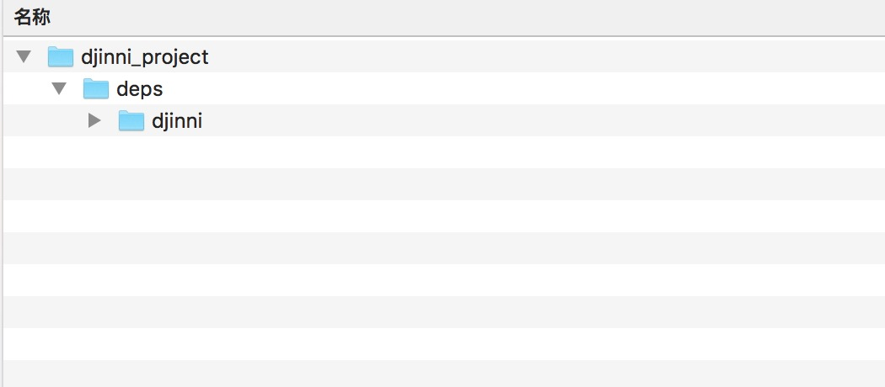
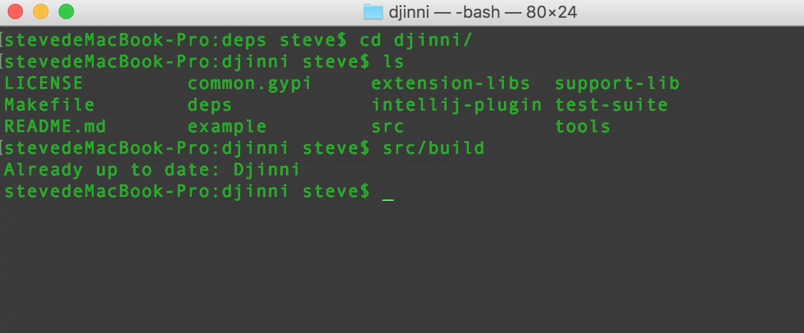

# djinni
一个根据djinni写成的demo（ios），解决了macOS Sierra下第一次build时出错的问题

# djinni介绍
Djinni 是一个用来生成跨语言的类型声明和接口绑定的工具，主要用于 C++ 和 Java 以及 Objective-C 间的互通。

- 好处：
 - 用了接口描述文件。声明清晰、修改简易，并保证了跨平台接口的一致性。
 - 自动生成接口绑定代码。免去了绑定 C++ 和 Java (JNI) 及 Objective-C (Objective-C++) 的麻烦。

# 1 配置djinni

## 1.1 下载djinni
	https://github.com/dropbox/djinni.git
将下载好的djinni放在[example_root]/deps/ 下

此时目录结构为：

## 1.2 编译djinni
	$ cd [djinni_root]/
	$ src/build
	

	
第一次编译的时候会去下载sbt配置

本人系统环境是macOS Sierra 10.12 , 在此环境下sbt下载失败，导致编译失败

如果sbt下载失败的话，项目中放置了一个sbt的压缩包（里边文件默认隐藏的），复制里边的文件到你的用户文件夹下就可以了

# 2 使用djinni

## 2.1 编写djinni格式文件
 
	hello_world = interface +c {
    	static create():hello_world;
    	get_hello_world(): string;
    	get_name(): string;
    	set_name(name:string);
	}
	
命名为helloworld.djinni 并放置在[example_root]/ 下
	
## 2.2 编写shell文件

	#! /usr/bin/env bash
 
	base_dir=$(cd "`dirname "0"`" && pwd)
	cpp_out="$base_dir/generated-src/cpp"
	jni_out="$base_dir/generated-src/jni"
	objc_out="$base_dir/generated-src/objc"
	java_out="$base_dir/generated-src/java/com/mycompany/helloworld"
	java_package="com.mycompany.helloworld"
	namespace="helloworld"
	objc_prefix="HW"
	djinni_file="helloworld.djinni"
 
	deps/djinni/src/run \
   		--java-out $java_out \
   		--java-package $java_package \
   		--ident-java-field mFooBar \
   		\
   		--cpp-out $cpp_out \
   		--cpp-namespace $namespace \
   		\
   		--jni-out $jni_out \
   		--ident-jni-class NativeFooBar \
   		--ident-jni-file NativeFooBar \
   		\
   		--objc-out $objc_out \
   		--objc-type-prefix $objc_prefix \
   		\
   		--objcpp-out $objc_out \
   		\
   		--idl $djinni_file

命名为run_djinni.sh 并放置在[example_root]/ 下

此时目录结构为：

## 2.3 生成接口代码

	$ cd [example_root]/  
	$ sh ./run_djinni.sh
	
运行成功输出：

以及现在目录结构：

	
这里可以看到：依据描述文件helloworld.djinni，C++ 和 Java 及 Objective-C 的绑定代码都会自动生成好。继续要做的，只是写它们的具体实现

